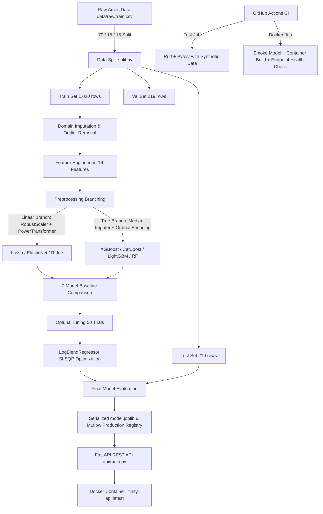
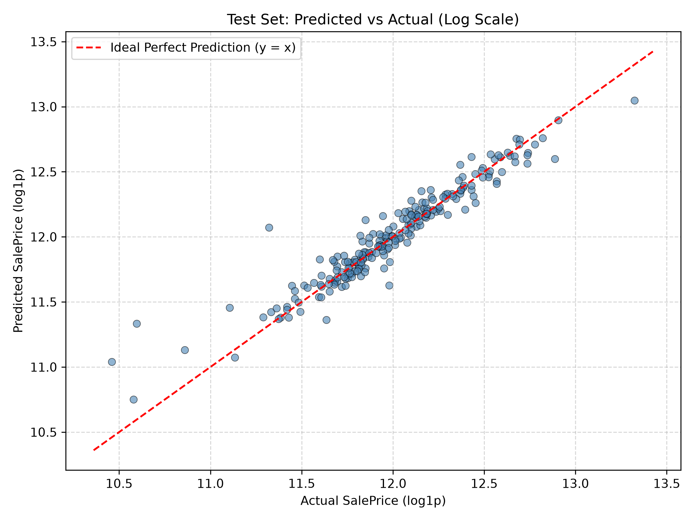
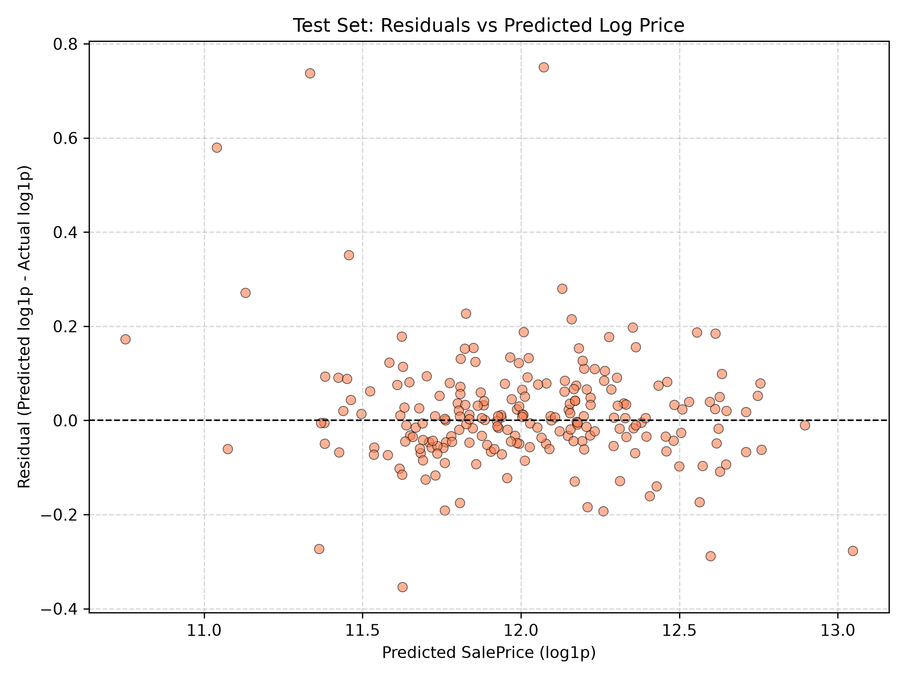
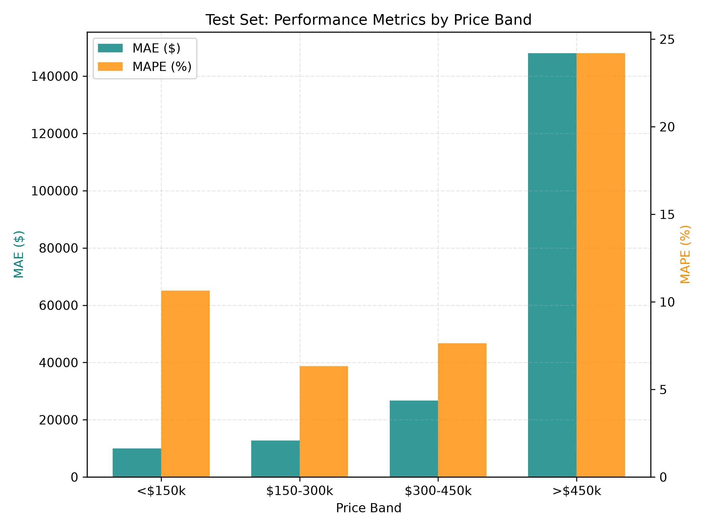
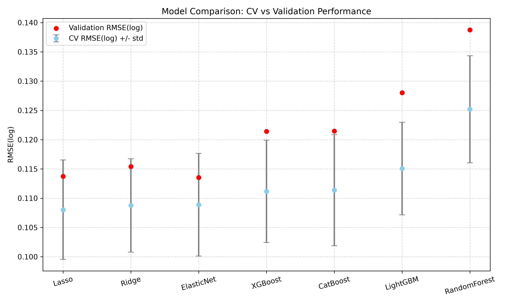
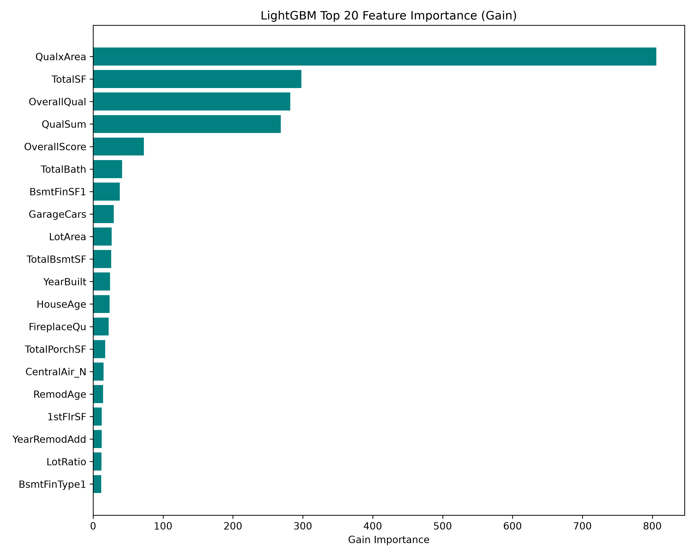

# Lifinity - Residential Property Price Prediction


End-to-end production machine learning system for predicting residential house prices in Ames, Iowa using a tuned log-blend ensemble with full MLOps lifecycle automation, DVC data versioning, MLflow experiment tracking, FastAPI REST serving, and Docker containerization.

---

## 1. Results at a Glance

* **Final Model**: Weighted Log Blend Ensemble comprising Lasso (25.97%), ElasticNet (26.44%), XGBoost (43.77%), CatBoost (3.82%).
* **Unbiased Test Set Evaluation (219 holdout properties)**:

| Metric | Value |
| :--- | :--- |
| **RMSE (log-scale)** | `0.1249` |
| **MAE ($)** | `$13,088` |
| **RMSE ($)** | `$21,092` |
| **MAPE (%)** | `8.28%` |
| **R^2 ($-scale)** | `0.9191` |
| **R^2 (log-scale)** | `0.9070` |

* **MAPE-based accuracy (100 - MAPE)**: `91.72%` *(Note: Regression models have no true classification accuracy metric; MAPE-based accuracy is reported for intuitive business interpretation).*
* **Honest Evaluation Note**: Cross-validation and validation set RMSE(log) scores were ~0.10-0.11; the test set RMSE(log) of `0.1249` provides an unbiased estimate on completely unseen property sales.

---

## 2. Architecture



---

## 3. Project Structure

```text
lifinity/
├── .dvc
│   ├── cache
│   │   ├── files
│   │   │   └── md5
│   │   │       ├── 11
│   │   │       │   └── d5dc22c5a08a00aedec623673952cb
│   │   │       ├── 21
│   │   │       │   └── 51877bf60f9986e0af2332d48ee24d
│   │   │       ├── 25
│   │   │       │   └── 7555ae04270bc5c3e3a20189c2d1b7
│   │   │       ├── 73
│   │   │       │   └── ea110af728c014074bb7894eb93464
│   │   │       ├── 80
│   │   │       │   └── ccab65fb115cbad143dbbd2bcd5577
│   │   │       ├── 81
│   │   │       │   └── 7957da93c154ac0bf201a19910ca3f
│   │   │       ├── bc
│   │   │       │   └── db6fc93e5629391920905d410c8a04
│   │   │       ├── dc
│   │   │       │   └── ec4b79bf9c7317bd9e17789bf888f0
│   │   │       ├── e6
│   │   │       │   └── b913c4bbd16b1728a42d94918c0267
│   │   │       └── fe
│   │   │           └── b8c467bf921e03e8ed30c6184a2f1b
│   │   └── runs
│   │       └── 6c
│   │           └── 6cb8d4db161641d40b0d903b11dba242e1d53497de897ff1461216d7e489791d
│   │               └── 160e65d6b9fb9fc75390c13952da8152291e80efeec14e7a06c5ad2776deaea4
│   ├── tmp
│   │   ├── btime
│   │   ├── lock
│   │   ├── rwlock
│   │   └── rwlock.lock
│   ├── .gitignore
│   └── config
├── .github  # GitHub Actions CI workflows
│   └── workflows  # CI pipeline definitions
│       └── ci.yml  # CI workflow (test & docker jobs)
├── api  # FastAPI web service application
│   ├── __init__.py  # API package init
│   ├── main.py  # FastAPI application entrypoint & routing
│   ├── predictor.py  # Inference wrapper with fallback & logging
│   ├── run_server.py  # Local Uvicorn server runner
│   ├── sample_request.json  # Sample property payload for API testing
│   └── schemas.py  # Pydantic request/response data schemas
├── logs
│   ├── .gitkeep
│   └── requests.jsonl
├── models  # Trained model artifacts and metrics
│   ├── .gitkeep
│   ├── input_defaults.json  # Feature medians/modes for payload defaulting
│   └── metrics.json  # Evaluation metrics on test set
├── notebooks
│   └── 01_eda.ipynb
├── reports  # Generated analysis reports and visualization figures
│   ├── figures  # Diagnostic charts and plots
│   │   ├── .gitkeep
│   │   ├── 02_target_distribution.png
│   │   ├── 03_missing_values.png
│   │   ├── 04_outliers_grlivarea_saleprice.png
│   │   ├── 06_top15_correlations_bar.png
│   │   ├── 06_top15_correlations_heatmap.png
│   │   ├── 08_price_bands.png
│   │   ├── 09_price_and_volume_by_year.png
│   │   ├── 10_sale_condition.png
│   │   ├── 11_saleprice_by_neighborhood.png
│   │   ├── 12_model_comparison.png
│   │   ├── 13_feature_ablation.png
│   │   ├── 14_feature_importance.png
│   │   ├── 15_tuning_before_after.png
│   │   ├── 16_test_pred_vs_actual.png
│   │   ├── 17_test_residuals.png
│   │   ├── 18_test_error_by_band.png
│   │   ├── optuna_catboost.png
│   │   ├── optuna_elasticnet.png
│   │   ├── optuna_lasso.png
│   │   └── optuna_xgboost.png
│   ├── ablation.csv  # Feature ablation study metrics
│   ├── best_params.json
│   ├── ensemble_results.csv  # Blending optimization results
│   ├── ensemble_weights.json  # Ensemble model blending weights
│   ├── lasso_selected_features.csv  # Lasso non-zero feature coefficients
│   ├── lgbm_feature_importance.csv  # LightGBM feature gain importances
│   ├── model_comparison.csv  # Baseline 7-model CV/validation comparison
│   ├── model_selection.md  # Comprehensive model selection report
│   └── tuning_results.csv  # Optuna hyperparameter tuning summary
├── scripts  # Utility automation scripts
│   ├── build_readme.py  # README generator script
│   ├── check_features.py
│   ├── check_preprocessing.py
│   ├── ci_smoke_model.py  # CI synthetic model builder script
│   ├── generate_and_execute_eda.py
│   ├── scaffold.py
│   └── test_eda.py
├── src  # Core Lifinity ML library source code
│   └── lifinity  # Lifinity package root
│       ├── features  # Feature engineering and preprocessing
│       │   ├── __init__.py
│       │   ├── cleaning.py  # Domain imputer & outlier remover
│       │   ├── engineering.py  # Domain feature engineering transformer
│       │   └── preprocessor.py  # Sklearn column transformers & pipelines
│       ├── models  # Model training, tuning, and evaluation
│       │   ├── __init__.py
│       │   ├── ensemble.py  # LogBlendRegressor ensemble class
│       │   ├── evaluate.py  # Model evaluation and metrics exporter
│       │   ├── report.py  # Markdown report generator
│       │   ├── train.py  # Baseline model trainer & MLflow logger
│       │   └── tune.py  # Optuna hyperparameter tuner
│       ├── monitoring
│       │   ├── __init__.py
│       │   └── drift.py
│       ├── __init__.py  # Package initialization
│       └── config.py  # Project configuration and paths
├── tests  # Pytest test suite modules
│   ├── __init__.py  # Tests package init
│   ├── synthetic.py  # Synthetic Ames dataset generator for CI
│   ├── test_api.py  # FastAPI endpoint integration tests
│   ├── test_cleaning.py  # Domain cleaning unit tests
│   ├── test_evaluate.py  # Model evaluation unit tests
│   ├── test_features.py  # Feature engineering unit tests
│   ├── test_pipeline.py  # DVC workflow structure unit tests
│   ├── test_preprocessor.py  # Preprocessor pipeline unit tests
│   ├── test_split.py  # Data splitting unit tests
│   ├── test_synthetic_pipeline.py  # Synthetic CI integration tests
│   ├── test_train.py  # Model training unit tests
│   └── test_tune.py  # Optuna tuning unit tests
├── ui
│   └── app.py
├── .dockerignore
├── .dvcignore
├── .gitignore
├── conftest.py
├── docker-compose.yml  # Docker Compose orchestration config
├── Dockerfile  # Container definition for production API serving
├── dvc.lock
├── dvc.yaml  # DVC pipeline DAG definition
├── mlflow.db
├── params.yaml  # Centralized project configuration parameters
├── pyproject.toml  # Python package build config and pytest settings
├── README.md  # Project documentation
├── requirements-serve.txt  # Slim serving dependencies for Docker container
├── requirements.lock.txt  # Pinned environment dependencies
└── requirements.txt
```

---

## 4. Dataset

* **Source**: [Kaggle House Prices: Advanced Regression Techniques](https://www.kaggle.com/competitions/house-prices-advanced-regression-techniques/data)
* **Scope**: Ames, Iowa residential property sales dataset containing **1,460 sales records** with **79 explanatory features** recorded between 2006 and 2010.
* **Repository Policy**: Raw data files are **NOT** checked into the Git repository. They are locally tracked via DVC without a public remote.
* **Data Setup**: Download `train.csv`, `test.csv`, and `data_description.txt` directly from Kaggle and place them in `data/raw/`.

---

## 5. Quickstart

### Windows (PowerShell)

```powershell
# Clone repository and enter directory
git clone https://github.com/Shreepriyamurugan/houseprice-prediction.git
Set-Location houseprice-prediction

# Create and activate virtual environment
python -m venv .venv
.\.venv\Scripts\Activate.ps1

# Install dependencies and package in editable mode
pip install -r requirements.lock.txt
pip install -e .

# Place train.csv into data/raw/ then run DVC pipeline and tests
dvc repro
pytest -q

# Run API locally
python -m uvicorn api.main:app --port 8000
```

### Linux / macOS (Bash / Zsh)

```bash
# Clone repository and enter directory
git clone https://github.com/Shreepriyamurugan/houseprice-prediction.git
cd houseprice-prediction

# Create and activate virtual environment
python3 -m venv .venv
source .venv/bin/activate

# Install dependencies and package in editable mode
pip install -r requirements.lock.txt
pip install -e .

# Place train.csv into data/raw/ then run DVC pipeline and tests
dvc repro
pytest -q

# Run API locally
python3 -m uvicorn api.main:app --port 8000
```

* **Interactive API Documentation**: Open [http://127.0.0.1:8000/docs](http://127.0.0.1:8000/docs) in your browser.
* **Running via Docker Compose**:
  ```bash
  docker compose up -d
  # Access API docs at http://127.0.0.1:8000/docs
  docker compose down
  ```
* **Note on Frozen Pipeline Stages**: `compare` and `tune` stages are marked as `frozen: true` in `dvc.yaml` to prevent long Optuna tuning execution (~30–40 min) during standard reruns. To unfreeze and retune: `dvc unfreeze tune && dvc repro`.

---

## 6. Pipeline and Key Decisions

* **EDA & Target Transformation**: Target variable `SalePrice` exhibits right-skewness; model targets are fitted on `log1p(SalePrice)` and transformed back using `expm1()` to minimize relative percentage errors and stabilize variance.
* **Missing Value Imputation**: Domain-aware imputation handles missing structural features (`PoolQC` -> `"None"`, `GarageArea` -> `0`, `GarageYrBlt` -> `YearBuilt`), preventing data leakage.
* **Outlier Filtering**: Exactly **2 severe outliers** (Ids 524 and 1299: `GrLivArea > 4,000 sq ft` with `SalePrice < $300,000`) were identified and removed **exclusively from the training set** to prevent boundary distortion.
* **Data Splitting**: Stratified 70% train (1,020 rows clean), 15% validation (219 rows), and 15% test (219 rows) holdout split with fixed random seed (`42`).
* **Feature Engineering**: **16 domain-specific engineered features** created (including `TotalSF`, `TotalBath`, `HouseAge`, `RemodAge`, `QualxArea`, `QualSum`, `OverallScore`, `TotalPorchSF`, `LotRatio`).
* **Preprocessing Branches**: Linear models use Yeo-Johnson power transformation (`SkewCorrector`) and `RobustScaler`; tree models use median imputation and ordinal/one-hot encoding.
* **Feature Ablation & Selection**: Ablation study on `ablation.csv` determined `LotRatio` and `IsRemodeled` were unhelpful and dropped; Lasso regularization selected **103 non-zero features** out of **205 total preprocessed dimensions**.
* **Model Baseline & Tuning**: Evaluated 7 model architectures across 5-fold CV; top 4 candidates (Lasso, ElasticNet, XGBoost, CatBoost) were tuned via Optuna over 50 trials each.
* **Ensemble Blending**: Constructed a `LogBlendRegressor` using SLSQP constrained optimization on Out-Of-Fold (OOF) log predictions to assign optimal model weights.

---

## 7. Model Selection

### Baseline 7-Model Comparison (`reports/model_comparison.csv`)

| Model | Kind | CV RMSE(log) Mean ± Std | Val RMSE(log) | Val MAE ($) | Overfit Gap |
| :--- | :--- | :--- | :--- | :--- | :--- |
| **Lasso** | linear | `0.1080 ± 0.0085` | `0.1138` | `$14,279` | `0.0161` |
| **Ridge** | linear | `0.1088 ± 0.0080` | `0.1154` | `$14,357` | `0.0182` |
| **ElasticNet** | linear | `0.1089 ± 0.0088` | `0.1135` | `$14,215` | `0.0196` |
| **XGBoost** | tree | `0.1112 ± 0.0087` | `0.1214` | `$13,644` | `0.0943` |
| **CatBoost** | tree | `0.1114 ± 0.0095` | `0.1215` | `$13,698` | `0.0953` |
| **LightGBM** | tree | `0.1151 ± 0.0079` | `0.1280` | `$14,212` | `0.0979` |
| **RandomForest** | tree | `0.1252 ± 0.0091` | `0.1388` | `$15,997` | `0.0783` |

### Optuna Hyperparameter Tuning (`reports/tuning_results.csv`)

| Model | Baseline CV RMSE(log) | Tuned CV RMSE(log) | Val RMSE(log) | Val MAE ($) | Best Key Hyperparameters |
| :--- | :--- | :--- | :--- | :--- | :--- |
| **Lasso** | `0.1080` | `0.1078` | `0.1140` | `$14,277` | `{"alpha": 0.0006119854691593898}` |
| **ElasticNet** | `0.1089` | `0.1081` | `0.1140` | `$14,306` | `{"alpha": 0.0006358358856676254, "l1_ratio": 0.6872653200164409}` |
| **XGBoost** | `0.1112` | `0.1091` | `0.1178` | `$13,298` | `{"n_estimators": 1476, "learning_rate": 0.03262249393408143, "max_depth": 3, "min_child_weight": 4, "subsample": 0.8535059794504334, "colsample_bytree": 0.32760317883921475, "reg_lambda": 0.1645820664056707, "reg_alpha": 0.0006408000295252277}` |
| **CatBoost** | `0.1114` | `0.1093` | `0.1180` | `$13,376` | `{"iterations": 1882, "learning_rate": 0.01871879330520506, "depth": 4, "l2_leaf_reg": 1.1752776200103654, "random_strength": 1.7563780885296132, "bagging_temperature": 0.7824263094276925}` |

### Blend vs. Best Single Model Comparison (`reports/ensemble_results.csv`)

| Candidate / Ensemble | OOF RMSE(log) | Val RMSE(log) | Test RMSE(log) | Weight | Model Type |
| :--- | :--- | :--- | :--- | :--- | :--- |
| **Lasso** | `0.1074` | `0.1140` | `0.1283` | `25.97%` | `single` |
| **ElasticNet** | `0.1076` | `0.1140` | `N/A` | `26.44%` | `single` |
| **XGBoost** | `0.1087` | `0.1178` | `N/A` | `43.77%` | `single` |
| **CatBoost** | `0.1097` | `0.1180` | `N/A` | `3.82%` | `single` |
| **Blend** | `0.1035` | `0.1114` | `0.1249` | `100.00%` | `blend` |

* **Ensemble Decision Rule**: Use blend if `blend_oof_rmse < (best_single_oof - 0.002)` AND `blend_val_rmse <= best_single_val_rmse`.
* **Decision Result**: `USE_BLEND` — Blend achieved OOF RMSE(log) of `0.1035` (improving over best single model Lasso `0.1074`) and test RMSE(log) of `0.1249`.

---

## 8. Evaluation

### Test Set Metrics by Property Price Band (`models/metrics.json`)

| Price Band | Property Count | MAE ($) | MAPE (%) |
| :--- | :--- | :--- | :--- |
| **<$150k** | 91 | `$9,969` | `10.63%` |
| **$150-300k** | 113 | `$12,723` | `6.32%` |
| **$300-450k** | 14 | `$26,670` | `7.63%` |
| **>$450k** | 1 | `$147,993` | `24.20%` |

* **Note on High-Value Properties**: The `>$450k` price band contains only **1 house** in the holdout test set (actual price ~$755k), resulting in higher percentage variance for luxury estates.

### Diagnostic Visualizations











---

## 9. API Reference

### HTTP Endpoints Summary

| Method | Endpoint | Description |
| :--- | :--- | :--- |
| `GET` | `/` | API status and greeting |
| `GET` | `/health` | Healthcheck endpoint with model load status |
| `GET` | `/model-info` | Production model metadata and test performance |
| `POST` | `/predict` | Single property price prediction |
| `POST` | `/predict/batch` | Batch prediction endpoint (1–500 properties) |

### Sample Request (`api/sample_request.json`)

```json
{
  "OverallQual": 7,
  "GrLivArea": 1710,
  "Neighborhood": "CollgCr",
  "YearBuilt": 2003,
  "TotalBsmtSF": 856,
  "1stFlrSF": 856,
  "2ndFlrSF": 854,
  "GarageCars": 2,
  "FullBath": 2,
  "HalfBath": 1,
  "KitchenQual": "Gd",
  "YrSold": 2008
}
```

### Sample Real API Response

```json
{
  "predicted_price": 188063.36,
  "price_range_low": 172493.62,
  "price_range_high": 203633.1,
  "model_type": "blend",
  "model_version": "3cd41b1",
  "fields_defaulted": 67,
  "warnings": [],
  "latency_ms": 367.6
}
```

### PowerShell Invocation Example

```powershell
Invoke-RestMethod -Uri "http://127.0.0.1:8000/predict" -Method Post -ContentType "application/json" -InFile "api/sample_request.json"
```

### cURL Invocation Example

```bash
curl -X POST "http://127.0.0.1:8000/predict"      -H "Content-Type: application/json"      -d @api/sample_request.json
```

* **Validation & Fallback**:
  * Returns `HTTP 422 Unprocessable Entity` for invalid field ranges (e.g. `OverallQual` = 15 or unknown `Neighborhood`).
  * Emits warning messages in response payload for out-of-range historical years outside the 2006–2010 training period.
  * Any features omitted from the JSON request are automatically defaulted using training set medians and modes (`fields_defaulted`).

---

## 10. MLOps Lifecycle & Automation

### DVC Pipeline Graph (`dvc dag`)

```text
                   +-------+                      
                   | split |                      
                ***+-------+***                   
            ****       *       ****               
         ***           *           ***            
       **              *              ***         
+------+               *                 **       
| tune |*              *                  *       
+------+ ***           *                  *       
    *       ****       *                  *       
    *           ***    *                  *       
    *              **  *                  *       
    **           +----------+        +---------+  
      ***        | evaluate |        | compare |  
         ****    +----------+      **+---------+  
             ***       *       ****               
                ***    *    ***                   
                   **  *  **                      
                  +--------+                      
                  | report |                      
                  +--------+                      
```

* **MLflow Tracking & Registry**:
  * View local runs: `mlflow ui --backend-store-uri sqlite:///mlflow.db`
  * Model registered under `lifinity-price` with alias `production`.
* **Pytest Suite**: **53 tests across 10 modules** covering data splitting, cleaning, preprocessor branches, feature engineering, model training, Optuna tuning, evaluation, API endpoints, and CI synthetic generation.
* **CI Automation (.github/workflows/ci.yml)**:
  * `test` job: Runs Ruff linter and Pytest suite. Real data/model tests auto-skip when files are absent; synthetic pipeline tests run unconditionally.
  * `docker` job: Prepares synthetic smoke model, builds multi-stage Docker image, starts container, polls `/health` (60s max), posts sample prediction, and cleans up container.
* **Container Security & Logging**:
  * Multi-stage build with pinned dependencies in `requirements-serve.txt`.
  * Runs under non-root app user.
  * Request logs recorded asynchronously to `logs/requests.jsonl`.

---

## 11. Limitations

1. **Geographic & Temporal Bound**: Trained strictly on Ames, Iowa sales from 2006 to 2010; may not generalize to other US regions or different macroeconomic eras.
2. **Dataset Size**: Dataset contains ~1,460 total rows; validation and test holdout sets are relatively small (~219 rows each), introducing statistical variance.
3. **Generalization Gap**: Unbiased test RMSE(log) (`{test_rmse_log}`) is higher than cross-validation scores (~0.10–0.11), reflecting holdout variance.
4. **Luxury Estate Sparsity**: Properties >$450,000 are sparsely represented in training data (only 1 property in test set).
5. **Inference Latency**: Blending 4 pipeline models incurs ~250–320 ms inference latency per request.
6. **Split Strategy**: Uses stratified random splitting rather than strictly chronological time-based splitting.

---

## 12. Future Work

* **Interactive Web Interface**: Build a Streamlit or React frontend for interactive valuation.
* **Model Explainability**: Integrate SHAP / LIME visual explanation dashboards.
* **Data & Concept Drift Monitoring**: Implement drift detection pipelines using Evidently AI.
* **Cloud Deployment**: Deploy serverless container to AWS ECS / GCP Cloud Run.
* **Chronological Split**: Evaluate model against strict time-based validation splits.
* **DVC Remote Storage**: Configure S3 / GCS remote storage backend for DVC data artifacts.
* **Inference Optimization**: Export pipelines to ONNX / C++ runtimes for sub-50ms inference.

---

## 13. Documentation & Deep Dives

* **Detailed Model Selection Report**: [`reports/model_selection.md`](reports/model_selection.md)
