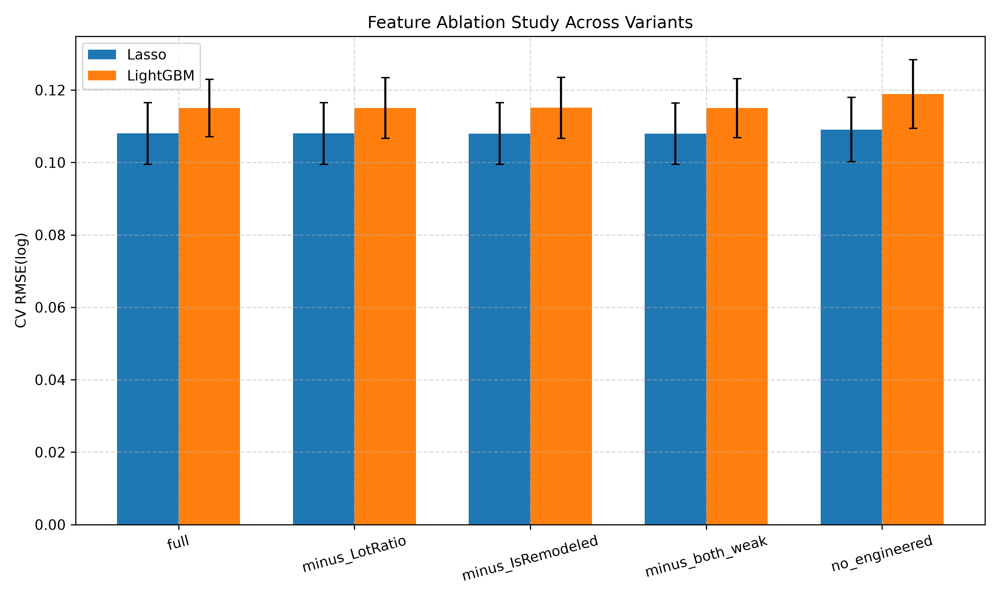
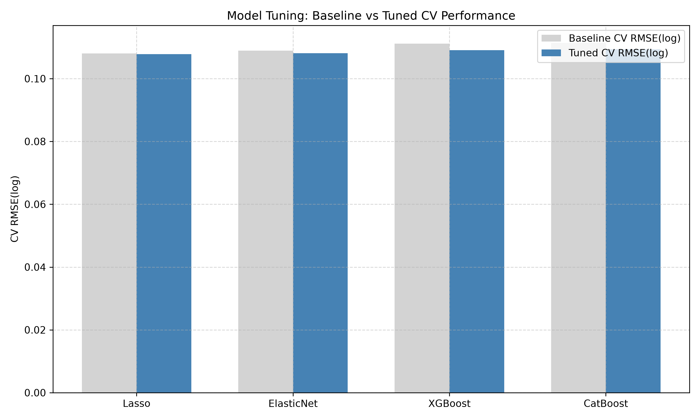

# Model Selection Report
**Date**: 2026-09-29 | **Git Commit**: `d3ac642` | **Data MD5**: `80ccab65fb115cbad143dbbd2bcd5577`

## Executive Summary
This document presents the complete modeling trajectory for the Lifinity Ames Housing price regression system, covering feature selection, baseline model comparison, hyperparameter tuning with Optuna, ensemble blending analysis, final model selection, and final holdout test evaluation.

## Data Split Summary
- **Train set**: 1,020 rows (70% split; 2 extreme outliers with `GrLivArea > 4000` & `SalePrice < $300k` removed)
- **Validation set**: 219 rows (15% split; untouched raw distribution)
- **Test set**: 219 rows (15% split; strictly held out for final evaluation)

## 1. Feature Selection & Importance
- **Lasso Embedded Selection**: Retained **103 / 205** non-zero coefficient features after L1 regularization.
  *(measured before LotRatio and IsRemodeled were dropped)*

### Top 10 Features by Lasso |Coefficient|
| Rank | Feature | Coefficient |
| --- | --- | --- |
| 1 | `TotalSF` | 0.1635 |
| 2 | `MSZoning_infrequent_sklearn` | -0.1145 |
| 3 | `Neighborhood_Crawfor` | 0.1017 |
| 4 | `Neighborhood_StoneBr` | 0.1009 |
| 5 | `HouseAge` | -0.0845 |
| 6 | `Exterior1st_BrkFace` | 0.0760 |
| 7 | `MSSubClass_90` | -0.0614 |
| 8 | `Neighborhood_BrkSide` | 0.0610 |
| 9 | `Neighborhood_NoRidge` | 0.0579 |
| 10 | `OverallScore` | 0.0572 |

### Top 10 Features by LightGBM Gain Importance
| Rank | Feature | Gain Importance |
| --- | --- | --- |
| 1 | `QualxArea` | 805.85 |
| 2 | `TotalSF` | 298.10 |
| 3 | `OverallQual` | 282.19 |
| 4 | `QualSum` | 268.42 |
| 5 | `OverallScore` | 72.66 |
| 6 | `TotalBath` | 41.50 |
| 7 | `BsmtFinSF1` | 38.06 |
| 8 | `GarageCars` | 29.64 |
| 9 | `LotArea` | 26.58 |
| 10 | `TotalBsmtSF` | 26.00 |

### Feature Ablation Study Results
| model    | variant           |   cv_rmse_log_mean |   cv_rmse_log_std |   val_rmse_log |   delta_vs_full |
|:---------|:------------------|-------------------:|------------------:|---------------:|----------------:|
| Lasso    | full              |           0.108028 |        0.00849877 |       0.113751 |     0           |
| Lasso    | minus_LotRatio    |           0.108007 |        0.00849239 |       0.113751 |    -2.06398e-05 |
| Lasso    | minus_IsRemodeled |           0.107968 |        0.00850633 |       0.113867 |    -5.93301e-05 |
| Lasso    | minus_both_weak   |           0.107947 |        0.00849971 |       0.113867 |    -8.03833e-05 |
| Lasso    | no_engineered     |           0.109107 |        0.00891723 |       0.113477 |     0.0010792   |
| LightGBM | full              |           0.115065 |        0.00791049 |       0.128031 |     0           |
| LightGBM | minus_LotRatio    |           0.11505  |        0.00838313 |       0.126333 |    -1.51872e-05 |
| LightGBM | minus_IsRemodeled |           0.115105 |        0.00843682 |       0.126134 |     3.97758e-05 |
| LightGBM | minus_both_weak   |           0.115021 |        0.00816036 |       0.125183 |    -4.35898e-05 |
| LightGBM | no_engineered     |           0.118938 |        0.00947818 |       0.122701 |     0.00387252  |

**Weak Feature Decisions**: `LotRatio` -> **DROP**, `IsRemodeled` -> **DROP** (removing them caused no CV degradation).
**Engineered Features Impact**: Removing all engineered features degraded CV RMSE by +0.0011 (Lasso) and +0.0039 (LightGBM).

## 2. Baseline Model Comparison (7 Models)
| model        | kind   |   cv_rmse_log_mean |   cv_rmse_log_std |   train_rmse_log_mean |   overfit_gap |   val_rmse_log |   val_mae |   val_r2 |   val_mape |   fit_time_mean |
|:-------------|:-------|-------------------:|------------------:|----------------------:|--------------:|---------------:|----------:|---------:|-----------:|----------------:|
| Lasso        | linear |           0.108028 |        0.00849877 |             0.0919215 |     0.0161062 |       0.113751 |   14279   | 0.923409 |  0.0829766 |         2.5738  |
| Ridge        | linear |           0.108762 |        0.00797751 |             0.0905236 |     0.018238  |       0.115405 |   14357.3 | 0.921165 |  0.0838224 |         1.16853 |
| ElasticNet   | linear |           0.108887 |        0.00877259 |             0.0893237 |     0.0195634 |       0.113521 |   14214.8 | 0.923718 |  0.0823274 |         3.13713 |
| XGBoost      | tree   |           0.111165 |        0.00873246 |             0.0168949 |     0.09427   |       0.121418 |   13644   | 0.912736 |  0.0851763 |         4.85818 |
| CatBoost     | tree   |           0.111374 |        0.00948943 |             0.0160446 |     0.0953296 |       0.121476 |   13697.7 | 0.912652 |  0.0832548 |        10.8041  |
| LightGBM     | tree   |           0.115065 |        0.00791049 |             0.0171299 |     0.0979351 |       0.128031 |   14211.8 | 0.902971 |  0.0879018 |         5.33182 |
| RandomForest | tree   |           0.125196 |        0.00914351 |             0.0468658 |     0.0783297 |       0.138751 |   15996.8 | 0.886043 |  0.0960885 |         2.94014 |

## 3. Hyperparameter Tuning (Optuna)
| model      | kind   |   baseline_cv_rmse |   tuned_cv_rmse |   tuned_cv_std |   baseline_val_rmse |   tuned_val_rmse |   val_mae |   val_mape |   val_r2 |
|:-----------|:-------|-------------------:|----------------:|---------------:|--------------------:|-----------------:|----------:|-----------:|---------:|
| Lasso      | linear |           0.108028 |        0.107779 |     0.00840505 |            0.113751 |         0.114019 |   14277.3 |  0.0832049 | 0.923047 |
| ElasticNet | linear |           0.108887 |        0.108081 |     0.00848185 |            0.113521 |         0.113953 |   14306.3 |  0.0831376 | 0.923137 |
| XGBoost    | tree   |           0.111165 |        0.109059 |     0.00833312 |            0.121418 |         0.117805 |   13297.9 |  0.081832  | 0.917852 |
| CatBoost   | tree   |           0.111374 |        0.109339 |     0.00987808 |            0.121476 |         0.117955 |   13376.3 |  0.0815781 | 0.917643 |

## 4. Ensemble Blending Analysis
- **Optimization**: SLSQP constrained optimization minimizing out-of-fold (OOF) RMSE(log).
- **Decision Rule**: USE BLEND only if blend OOF RMSE is > 0.002 lower than best single model AND val RMSE <= best single model.
- **Decision Result**: **`USE_BLEND`**

### Ensemble Results Table
| model      |   oof_rmse_log |   val_rmse_log |   val_mae |   val_mape |   val_r2 |    weight | type   |
|:-----------|---------------:|---------------:|----------:|-----------:|---------:|----------:|:-------|
| Lasso      |       0.107432 |       0.114019 |   14277.3 |  0.0832049 | 0.923047 | 0.259659  | single |
| ElasticNet |       0.107604 |       0.113953 |   14306.3 |  0.0831376 | 0.923137 | 0.26438   | single |
| XGBoost    |       0.108678 |       0.117805 |   13297.9 |  0.081832  | 0.917852 | 0.437725  | single |
| CatBoost   |       0.109678 |       0.117955 |   13376.3 |  0.0815781 | 0.917643 | 0.0382369 | single |
| Blend      |       0.10351  |       0.111421 |   13140.7 |  0.078327  | 0.926514 | 1         | blend  |

## Final model
- **Selected Architecture**: **BLEND** (`kind=blend (linear + tree)`)
- **Validation RMSE(log)**: `0.1114`
- **Validation MAE**: `$13,140.68`
- **Validation R^2 (log scale)**: `0.9265`
- **Validation MAPE**: `7.83%`
- **MAPE-based Accuracy Metric**: **`92.17%`**

### Blend Model Weights
| Model | Weight (%) |
| --- | --- |
| Lasso | 25.97% |
| ElasticNet | 26.44% |
| XGBoost | 43.77% |
| CatBoost | 3.82% |

## Final test evaluation
- **Status**: Evaluated on held-out test set (219 rows)
- **Test RMSE(log)**: `0.1249`
- **Test MAE**: `$13,088.17`
- **Test RMSE ($)**: `$21,091.65`
- **Test MAPE**: `8.28%`
- **Test R^2 (log scale)**: `0.9070`
- **Test R^2 ($ scale)**: `0.9191`

### Error Breakdown by Price Band
| Price Band | Count | MAE ($) | MAPE (%) |
| --- | --- | --- | --- |
| <$150k | 91 | $9,969.45 | 10.63% |
| $150-300k | 113 | $12,723.18 | 6.32% |
| $300-450k | 14 | $26,669.71 | 7.63% |
| >$450k | 1 | $147,993.32 | 24.20% |

### Reference Model Performance
- **Lasso (reference, not used for selection)**: Test RMSE(log) = `0.1283`, MAE = `$13,725.93`, MAPE = `8.63%`

## System Limitations & Risks
1. **Sample Size Constraints**: Validation set has ~219 samples; small evaluation sets exhibit variance across splits.
2. **Geographic & Temporal Scope**: Trained on Ames, Iowa housing data (2006-2010); non-generalizable to current interest rate regimes or unobserved regions without recalibration.
3. **Tree Model Overfitting**: GBDT models exhibit larger train vs CV gaps (~0.09) compared to linear models (~0.016).

## Performance Visualizations

